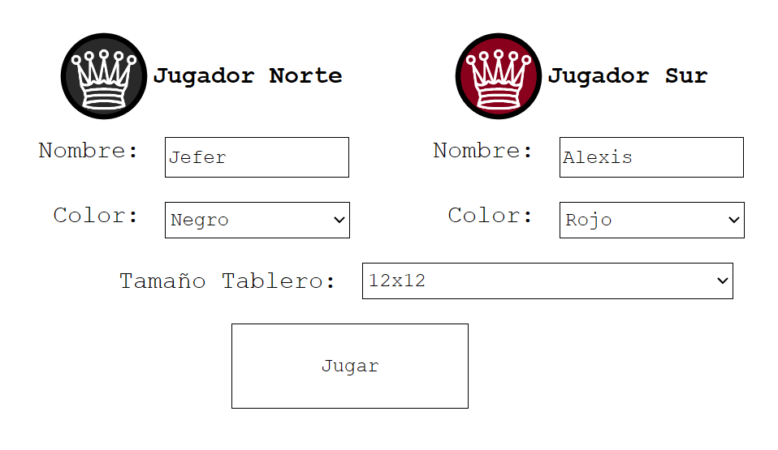
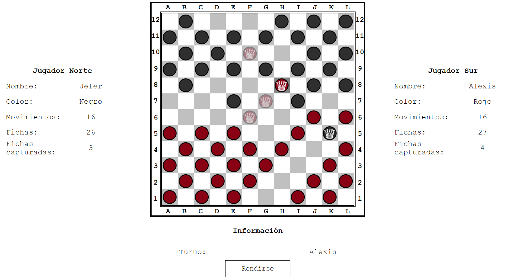
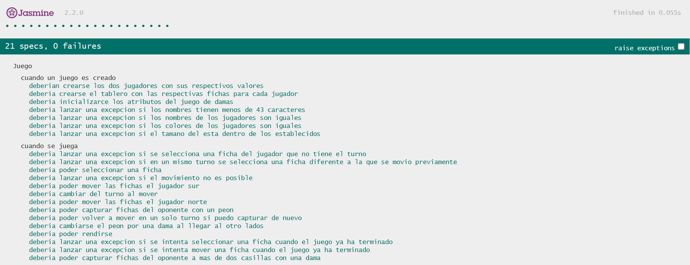

## Juego de Damas

Esta es una aplicación web que implementa el juego de Damas desarrollada como proyecto para el curso FrontEnd Developer ofrecido por la universidad Escuela Colombiana de Ingeniería Julio Garavito.

## Descripción

La aplicación tiene una página de inicio donde los jugadores ingresan su información y personalizan la configuración del juego. Después de enviar la información del jugador, el juego comienza en una nueva página donde se muestran el tablero de juego y la información del jugador.

El juego de damas consiste en mover piezas en diagonal a través de los cuadrados oscuros de un tablero de ajedrez de 10x10. Dos jugadores se turnan para mover una pieza a la vez, capturando las piezas del oponente saltando sobre ellas. El objetivo es dejar al oponente sin movimientos válidos o capturar todas sus piezas.

## Características

* Nombres de jugadores y colores de piezas personalizables.
* Resaltado de movimiento válido
* Captura de piezas
* Mecánica de dama cuando las piezas llegan al final del tablero.
* Condición de victoria cuando a un jugador no le quedan movimientos ni piezas válidas

## Detalles técnicos

* Interfaz HTML, CSS y JavaScript
* KnockoutJS para el patrón MVVM
* JQuery para manipulación DOM
* Jasmine para pruebas unitarias

## Capturas de pantalla

Página de configuración de información del jugador



Tablero de juego y piezas



Pruebas unitarias hechas con el framework Jasmine



## Ejecución del proyecto

1. Clona el repositorio:
    ```
    git clone https://github.com/AlexisGR117/Proyecto-Front-End-Developer.git
    ```
2. Navega a la carpeta del proyecto:
    ```
    cd Proyecto-Front-End-Developer
    ```
3. Abre el archivo index.html.

## Autor

* Jefer Alexis González Romero